# ansible-playbooks

> Node-level automation for the Vollminlab Kubernetes cluster — the changes that have to happen on
> the machines, not in Git.


The cluster itself is GitOps-managed — Flux reconciles everything that lives in the Kubernetes API.
This repo covers the layer underneath it: apt packages, systemd units, containerd config, and the
kubeadm static-pod manifests on the nine nodes. Every playbook here is a *rolling* operation, which
is the one non-obvious thing about them: they all run `serial: 1`, they cordon and drain the node
they are about to touch, and they gate on cluster health — etcd quorum on control planes, Longhorn
volume health on workers — before moving to the next node. The cluster stays available throughout.

Everything runs from `ansible01.vollminlab.com`.

---

## Architecture

Each play runs against one node at a time, but it is really operating on two machines at once:

| Runs on | Via | Used for |
|---------|-----|----------|
| The managed node | SSH as `vollmin`, `become: true` | `apt`, `systemd`, file edits under `/etc`, `crictl`, `iscsiadm` |
| ansible01 | `delegate_to: localhost` + `become: false` | every `kubectl` call — drain, uncordon, `wait`, and all health gates |

There is no kubeconfig on the managed nodes in this model; `kubectl` always executes locally on
ansible01 against its own `~/.kube/config`. That is why a broken kubeconfig on ansible01 breaks the
health gates even though the node itself is fine.

Kubernetes node names are the **short** hostnames, while the inventory uses FQDNs. Every play except
the first derives one from the other:

```yaml
short_name: "{{ inventory_hostname | regex_replace('\\.vollminlab\\.com$', '') }}"
```

### Inventory

`inventory/hosts.ini` — three groups, nine hosts, no dynamic inventory:

| Group | Hosts |
|-------|-------|
| `control_plane` | `k8scp01`, `k8scp02`, `k8scp03` (`.vollminlab.com`) |
| `workers` | `k8sworker01` … `k8sworker06` (`.vollminlab.com`) |
| `k8s` | `control_plane` + `workers` — all nine nodes |

`[k8s:vars]` sets `ansible_user=vollmin`. Per-host `inventory/host_vars/<fqdn>/vars.yml` files hold
exactly one variable each: the vault-encrypted `ansible_become_password`.

### Layout

```
ansible.cfg                          # inventory path, SSH key, connection settings
inventory/
  hosts.ini                          # all managed hosts, grouped by role
  host_vars/<fqdn>/vars.yml          # vault-encrypted ansible_become_password, one per node
playbooks/
  k8s-upgrade.yml                    # Kubernetes minor-version upgrade, one hop at a time
  os-patch.yml                       # rolling apt full-upgrade + reboot-if-required
  harden-cp-probes.yml               # widen apiserver/etcd probes + KCM/scheduler leader-election
  cp-containerd-upgrade.yml          # control-plane containerd 1.7.27 -> 2.2.4
  containerd-dockerhub-mirror.yml    # route docker.io through the Harbor pull-through cache
  kubelet-vm-lt-mount-ordering.yml   # k8sworker01: order kubelet after the /mnt/vm-lt mount
```

There are no roles, no `group_vars`, and no `requirements.yml`. Every module used — `apt`, `command`,
`copy`, `debug`, `file`, `pause`, `reboot`, `replace`, `shell`, `stat`, `systemd` — ships with
`ansible-core`, so no Galaxy collections need to be installed.

## Playbooks

| Playbook | Targets | What it does | Re-running it |
|----------|---------|--------------|---------------|
| `k8s-upgrade.yml` | `k8scp01`, then `k8scp02`+`k8scp03`, then `workers` | One Kubernetes minor-version hop across all 9 nodes | Per hop. Package installs and manifest patches are idempotent; the `kubeadm upgrade` steps re-execute. Scope a resume with `--limit`. |
| `os-patch.yml` | `{{ patch_hosts }}`, default `k8s` | `apt full-upgrade` + reboot only if required | By design — re-run whenever apt has updates |
| `harden-cp-probes.yml` | `control_plane` | Widens apiserver/etcd liveness probes and KCM/scheduler leader-election windows | Idempotent, no-op once applied |
| `containerd-dockerhub-mirror.yml` | `k8s` (all 9) | Points containerd's `docker.io` resolution at the Harbor proxy cache | Idempotent, no-op once applied |
| `cp-containerd-upgrade.yml` | `control_plane` | Pins `containerd.io` to `2.2.4-1~ubuntu.24.04~noble` | One-shot. Re-running is a package no-op but **still drains each CP node and restarts containerd** |
| `kubelet-vm-lt-mount-ordering.yml` | `k8sworker01` only | Installs a kubelet drop-in requiring `/mnt/vm-lt` to be mounted | Idempotent; no kubelet restart |

### Conventions every playbook follows

- **`serial: 1`** everywhere except `kubelet-vm-lt-mount-ordering.yml`, which targets a single host.
  At most one node is ever in a partial state.
- **Drain flags are always** `--ignore-daemonsets --delete-emptydir-data --force --disable-eviction`.
  `--disable-eviction` deletes pods directly instead of evicting them, so **PodDisruptionBudgets are
  bypassed** — that is deliberate, because a PDB that cannot be satisfied would otherwise hang the
  roll indefinitely, but it means the drain will happily take the last replica of a workload.
- **Every write is followed by a read-back.** Manifest edits use `replace:` and are immediately
  re-checked with `grep -q`, so a regex that silently matched nothing fails the play instead of
  producing a node that looks upgraded and isn't.
- **Uncordon and `kubectl wait` are wrapped in `until` retry loops** (typically 10 × 15s and
  12 × 15s), because the apiserver on a just-restarted control-plane node is not immediately
  reachable.

## Prerequisites

ansible01 must have:

- `ansible-core` (no Galaxy collections required — see [Layout](#layout))
- `kubectl` and a working `~/.kube/config` for the cluster — all health gates run locally
- `~/.ssh/ansible_k8s_ed25519` — the dedicated Ansible SSH key, authorized on all nine nodes
- The Ansible Vault password (see below)

`ansible.cfg` sets the connection model:

| Setting | Value |
|---------|-------|
| `inventory` | `inventory/hosts.ini` |
| `remote_user` | `vollmin` |
| `private_key_file` | `~/.ssh/ansible_k8s_ed25519` |
| `host_key_checking` | `False` |
| `stdout_callback` | `yaml` |
| `retry_files_enabled` | `False` |
| `ssh_args` | `-o IdentitiesOnly=yes -o ForwardAgent=no` |
| `pipelining` | `True` |

`IdentitiesOnly=yes` plus `ForwardAgent=no` means the run uses that one key and nothing else — no
agent key is offered to, or forwarded onto, a managed node.

## Vault password — required for every run

Each node's `ansible_become_password` is stored as an inline `!vault`-encrypted value in
`inventory/host_vars/<fqdn>/vars.yml`. These are the only encrypted values in the repo, and there are
no separate `vault.yml` files. Every playbook here uses `become: true`, so **all runs must supply the
vault password** or they fail at "Gathering Facts" with
`Attempting to decrypt but no vault secrets found`.

Append `--ask-vault-pass` to prompt for it interactively:

```bash
ansible-playbook playbooks/<playbook>.yml --ask-vault-pass
```

Or point at a vault password file (`--vault-password-file ~/.vault_pass`, or set
`ANSIBLE_VAULT_PASSWORD_FILE`). `.gitignore` excludes `vault_pass.txt`, `.vault_pass`, and
`*/vault.yml` so a plaintext password can never be committed.

## Rolling Kubernetes upgrade

`k8s-upgrade.yml` is the largest playbook here and the one to read before running anything. It
performs **one minor-version hop** across all nine nodes, and it is parameterised — nothing about the
version is baked in:

```bash
ansible-playbook playbooks/k8s-upgrade.yml -e "target_version=1.35.5 target_minor=1.35" --ask-vault-pass
```

| Variable | Example | Used for |
|----------|---------|----------|
| `target_minor` | `1.35` | the `pkgs.k8s.io/core:/stable:/v<minor>/deb/` apt repo written to `/etc/apt/sources.list.d/kubernetes.list` |
| `target_version` | `1.35.5` | the exact package version — installed as `kubeadm={{ target_version }}-*`, and passed to `kubeadm upgrade apply v{{ target_version }} --yes` |

Kubernetes only supports one minor version per hop, so a multi-version upgrade is several sequential
runs. The playbook header records the planned path:

| Hop | From | To | `-e` arguments |
|-----|------|-----|----------------|
| 1 | 1.32 | 1.33.12 | `target_version=1.33.12 target_minor=1.33` |
| 2 | 1.33 | 1.34.8 | `target_version=1.34.8 target_minor=1.34` |
| 3 | 1.34 | 1.35.5 | `target_version=1.35.5 target_minor=1.35` |
| 4 | 1.35 | 1.36.1 | `target_version=1.36.1 target_minor=1.36` |

Wait for each hop to finish before starting the next.

### Sequence

Three plays run back to back: `k8scp01` alone, then `k8scp02` and `k8scp03`, then the six workers —
all at `serial: 1`, so exactly one node is drained at any moment.

```mermaid
flowchart TB
    START[ansible-playbook k8s-upgrade.yml<br/><i>one minor-version hop per run</i>] --> P1

    subgraph P1["Play 1 · k8scp01 · serial 1"]
        direction TB
        A1[point apt at the new minor repo<br/>install + hold kubeadm] --> A2[kubeadm upgrade apply]
        A2 --> A3[re-patch static pods<br/><i>metrics 0.0.0.0 · probes 24 · leader-election</i>]
        A3 --> A4[drain, eviction disabled]
        A4 --> A5[install kubelet + kubectl<br/>restart kubelet]
        A5 --> A6[pause 30s for apiserver]
        A6 --> A7[uncordon, then wait Ready]
    end

    P1 --> P2

    subgraph P2["Play 2 · k8scp02 then k8scp03 · serial 1"]
        direction TB
        B1[install + hold kubeadm] --> B2[kubeadm upgrade node]
        B2 --> B3[re-patch static pods]
        B3 --> B4[drain, eviction disabled]
        B4 --> B5[install kubelet + kubectl<br/>restart kubelet]
        B5 --> B6[pause 30s for apiserver]
        B6 --> B7[uncordon, then wait Ready]
    end

    P2 --> P3

    subgraph P3["Play 3 · workers, one at a time · serial 1"]
        direction TB
        C1[install + hold kubeadm] --> C2[kubeadm upgrade node]
        C2 --> C3[delete kyverno admission pod<br/>wait for rollout]
        C3 --> C4[drain, eviction disabled]
        C4 --> C5[install kubelet + kubectl<br/>restart kubelet]
        C5 --> C6[uncordon, then wait Ready]
        C6 --> C7[wait instance-manager Running<br/>purge stale Longhorn iSCSI sessions]
        C7 --> C8{all volumes healthy<br/>within 30 min?}
        C8 -- no --> C9[relocate stopped replicas<br/>off disk-pressure nodes]
        C9 --> C10{any volume faulted?}
        C8 -- yes --> C10
        C10 -- yes --> CFAIL[roll stops here]
        C10 -- no --> CNEXT[next worker]
    end

    CNEXT -. serial 1 .-> C1
```



Per node the package work is identical everywhere: rewrite `kubernetes.list` to the new minor repo,
`apt-get update`, `apt-mark unhold kubeadm` → install the pinned version → `apt-mark hold kubeadm`,
run kubeadm, then the same unhold/install/hold cycle for `kubelet` and `kubectl`, then
`systemctl restart kubelet`. Only `k8scp01` runs `kubeadm upgrade apply`; every other node runs
`kubeadm upgrade node`.

### What the control-plane plays re-patch, and why

`kubeadm upgrade` regenerates the static-pod manifests in `/etc/kubernetes/manifests/`, discarding
every local customisation. Both control-plane plays therefore re-apply the same five patches
immediately after kubeadm runs — each one followed by a verifying `grep`:

| Manifest | Patch | Without it |
|----------|-------|------------|
| `etcd.yaml` | `--listen-metrics-urls` `127.0.0.1:2381` → `0.0.0.0:2381` | Prometheus cannot scrape etcd |
| `kube-controller-manager.yaml` | `--bind-address` `127.0.0.1` → `0.0.0.0` | Prometheus cannot scrape KCM |
| `kube-scheduler.yaml` | `--bind-address` `127.0.0.1` → `0.0.0.0` | Prometheus cannot scrape the scheduler |
| `kube-apiserver.yaml`, `etcd.yaml` | liveness `failureThreshold` `8` → `24` | kubelet SIGKILLs apiserver/etcd on an ~80s blip |
| `kube-controller-manager.yaml`, `kube-scheduler.yaml` | adds `--leader-elect-lease-duration=30s`, `--leader-elect-renew-deadline=20s`, `--leader-elect-retry-period=4s` | controllers lose leadership and restart on a >10s etcd stall |

The last two are the same patches `harden-cp-probes.yml` applies — see
[Control-plane hardening](#control-plane-hardening) for the incidents that motivated them. They are
duplicated into this playbook rather than chained, so an upgrade can never leave a window where the
control plane is running with kubeadm's defaults.

The leader-election `replace:` regex carries a negative lookahead
(`(?!(?P=indent)- --leader-elect-lease-duration)`) so re-running never appends the flags twice.

### Worker-specific steps

**Kyverno is evicted before the drain.** Before draining a worker, the play deletes that node's
`kyverno-admission-controller` pod and waits for `kubectl rollout status` to report the deployment
fully ready again. Kyverno's admission webhooks are fail-closed, so letting the drain take down the
last ready admission-controller pod would start rejecting pod creation cluster-wide — including the
pods being rescheduled off the node currently draining.

**The Longhorn gate runs after the uncordon, not before it.** The order is: uncordon → wait Ready →
wait for the node's Longhorn instance-manager pod → clean up stale iSCSI sessions → wait for volume
health. It gates the *next* node, not the one just finished, which is the point: a worker reboot or
kubelet restart detaches volumes, and rolling on to the next replica holder before the previous
node's replicas have rebuilt is what turns degraded volumes into faulted ones.

The gate has three deliberate behaviours:

- **Stale iSCSI sessions are purged first.** Any session whose IQN matches `iqn.2019-10.io.longhorn`
  and whose portal IP is *not* a current instance-manager pod IP is logged out and deleted.
  Non-Longhorn sessions are untouched.
- **`ReplicaSchedulingFailure` is not a blocker.** A volume degraded only because the cluster has no
  room for a third replica will never go healthy; the gate detects that case and passes, warning per
  volume instead of stalling for 30 minutes.
- **Only `faulted` is fatal.** The health wait is `ignore_errors: true` — 60 retries × 30s, so up to
  30 minutes — and if it times out the play attempts remediation (deleting `stopped` replicas that
  are stranded on disk-pressure nodes so Longhorn re-places them) and then waits up to another 15
  minutes. After all that, a still-*degraded* volume only produces a warning; a **faulted** volume
  fails the play and stops the roll.

### Before running

```bash
kubectl get nodes                 # all nine Ready
kubectl get pvc -A | grep -v Bound # nothing Pending
```

Check whether a newer patch release exists for the target minor before committing to a version:

```bash
curl -sL https://pkgs.k8s.io/core:/stable:/v1.35/deb/Packages \
  | grep -A2 "^Package: kubeadm$" | grep Version | sort -V | tail -1
```

### If it fails partway

`serial: 1` bounds the damage to a single node, but that node can be left in one of two states worth
knowing about:

- **Cordoned and drained.** Uncordon is the last step for a node; a failure anywhere between the
  drain and the uncordon leaves it `SchedulingDisabled` with no workloads. Nothing un-does this
  automatically — run `kubectl uncordon <short-name>` yourself.
- **Packages unheld.** `apt-mark unhold` runs *before* each install and `apt-mark hold` *after*, so a
  failure in between leaves `kubeadm`, `kubelet`, or `kubectl` unheld and eligible for an unplanned
  apt upgrade. Check with `apt-mark showhold`.

Nodes that already completed are fully upgraded and back in service. Resume by re-running the same
hop scoped to what is left:

```bash
ansible-playbook playbooks/k8s-upgrade.yml \
  -e "target_version=1.35.5 target_minor=1.35" \
  --limit 'k8sworker04.vollminlab.com,k8sworker05.vollminlab.com,k8sworker06.vollminlab.com' \
  --ask-vault-pass
```

## OS patching

`os-patch.yml` is the **general, reusable** OS patcher — routine Ubuntu point upgrades (24.04.x →
24.04.4), kernel and security updates, any `apt full-upgrade` that may need a reboot. It is **not**
Kubernetes-version-specific: it never touches kubeadm/kubelet/kubectl and never rebinds the CP
metrics addresses, because an apt upgrade leaves the static-pod manifests alone.

```bash
# all control-plane nodes, one at a time
ansible-playbook playbooks/os-patch.yml -e patch_hosts=control_plane --ask-vault-pass
# a single node
ansible-playbook playbooks/os-patch.yml -e patch_hosts=k8scp01.vollminlab.com --ask-vault-pass
# all workers
ansible-playbook playbooks/os-patch.yml -e patch_hosts=workers --ask-vault-pass
```

`patch_hosts` defaults to `k8s` (every node) and accepts any group name or host pattern. Always
`serial: 1`. Per node it drains, runs `apt full-upgrade` with `autoremove` and
`force-confdef,force-confold` (so a conffile prompt can never block the run), reboots **only** if
`/var/run/reboot-required` exists, waits for the node to report Ready, then uncordons.

The gates differ by role, and the play decides from group membership (`is_control_plane` /
`is_worker`):

- **Control plane** — an etcd-health gate **before** the drain (all three members must report
  `is healthy`, checked by `etcdctl endpoint health --cluster` from inside the etcd static pod) and
  an etcd-rejoin gate **after** the reboot, before the uncordon. A reboot restarts the etcd static
  pod and 3-node etcd tolerates only one member down.
- **Workers** — the same Longhorn gate as the upgrade playbook: purge stale iSCSI sessions, wait for
  every volume to be healthy, treat `ReplicaSchedulingFailure` as acceptable, hard-fail on any
  faulted volume.

One difference from `k8s-upgrade.yml`: here the Longhorn health wait is **not** `ignore_errors`, and
there is no replica-relocation remediation. If volumes have not recovered within 30 minutes the run
stops rather than rolling on.

Run only when the cluster is healthy to begin with — all etcd members healthy, all Longhorn volumes
healthy.

## Control-plane hardening

`harden-cp-probes.yml` applies two independent shock absorbers to the static-pod manifests so a
transient etcd disk-latency blip can't cascade into a cluster-wide control-plane restart storm.

**1. Liveness probes (kube-apiserver + etcd).** Raises each liveness `failureThreshold` from `8` to
`24`; with `periodSeconds=10` that widens tolerance from ~80s to ~240s, so a blip no longer lets
kubelet SIGKILL apiserver/etcd.

*Why:* on 2026-06-19 a brief storage I/O stall spiked etcd WAL fsync to ~1s. All three apiservers'
`/livez` failed, the kubelet SIGKILLed them, and every `--leader-elect` controller in the cluster
restarted (11 `PodCrashLooping` alerts).

**2. Leader-election timeouts (kube-controller-manager + kube-scheduler).** The kubeadm defaults run
these controllers with a bare `--leader-elect=true`, which gives them only 10s to renew a lease
(lease 15s / renew 10s / retry 2s). This play adds explicit flags doubling every window — lease
`30s`, renew-deadline `20s`, retry-period `4s` — so a controller can ride out a multi-second etcd
fsync spike without losing leadership and restarting.

*Why:* on 2026-07-04 the nightly Velero `daily-full` backup (kopia FSB, one PodVolumeBackup per
volume) spiked etcd WAL fsync from a ~14ms baseline to 54ms. That blew the 10s renew deadline and
knocked four leader-elected controllers into simultaneous restarts. Probe widening addresses the
SIGKILL mode; leader-election widening addresses the lease-loss mode.

Both are shock absorbers — they tolerate a blip but don't remove it. The trigger itself (etcd sharing
a physical ZFS pool with noisy neighbours) is removed by storage isolation onto per-host local NVMe;
see the `etcd-local-nvme-migration` runbook in the k8s cluster repo.

```bash
ansible-playbook playbooks/harden-cp-probes.yml --ask-vault-pass
```

The play is **idempotent** and runs `serial: 1`. It does not drain: editing a static-pod manifest
makes kubelet restart that pod in place, so the play waits 25s and then gates on all four static pods
(`kube-apiserver-`, `etcd-`, `kube-controller-manager-`, `kube-scheduler-<short-name>`) reporting
Ready before moving on — keeping etcd/apiserver quorum (2/3) intact. The same patches are baked into
`k8s-upgrade.yml` because kubeadm regenerates the manifests (resetting the probes to `8` and dropping
the leader-election flags) on every upgrade.

## Docker Hub pull-through cache (containerd mirror)

`containerd-dockerhub-mirror.yml` configures every node's containerd to pull `docker.io` images
through the Harbor `dockerhub-proxy` project. This caches Docker Hub images in Harbor after the first
pull, eliminating the anonymous rate-limit `ImagePullBackOff` storms that hit on mass reschedules
(the cluster shares one egress IP against Docker Hub's ~100 anonymous pulls/6h limit).

It is transparent — image refs stay `docker.io/...` and containerd silently resolves them via Harbor.
`registry-1.docker.io` remains the fallback `server`, so if Harbor is down, pulls go directly to
Docker Hub.

Prereq: the Harbor proxy-cache project must exist (created in the k8s repo) and be public. Harbor
uses a publicly-trusted Let's Encrypt cert, so no CA injection is needed on the nodes.

```bash
ansible-playbook playbooks/containerd-dockerhub-mirror.yml --ask-vault-pass
```

What it does, per node (`serial: 1`):

1. Sets `config_path = "/etc/containerd/certs.d"` in the **CRI** registry block of
   `/etc/containerd/config.toml`. The regex is anchored to
   `[plugins."io.containerd.grpc.v1.cri".registry]` so the identical `config_path = ""` line under
   `[plugins."io.containerd.transfer.v1.local"]` is never touched — and the play then asserts that
   exactly one `config_path = ""` line remains, which is how it proves it edited the right one.
2. Writes `/etc/containerd/certs.d/docker.io/hosts.toml` with
   `[host."https://harbor.vollminlab.com/v2/dockerhub-proxy"]`, `capabilities = ["pull", "resolve"]`,
   `override_path = true`.
3. Restarts containerd **only if something changed** (no drain — a containerd restart does not evict
   pods; kubelet reconnects in seconds).
4. Verifies `crictl pull docker.io/library/busybox:latest` succeeds and the node returns Ready before
   moving to the next node.

Idempotent: re-running is a no-op once applied, including the containerd restart. New nodes should
run this playbook before joining production workloads.

## kubelet vm-lt mount ordering (k8sworker01)

`kubelet-vm-lt-mount-ordering.yml` installs
`/etc/systemd/system/kubelet.service.d/20-vm-lt-mount.conf` on **k8sworker01 only**, containing
`RequiresMountsFor=/mnt/vm-lt`, so kubelet refuses to start until the VictoriaMetrics cold-tier
filesystem is mounted.

Why: the cold tier (`victoria-metrics-lt`) stores ~13 months of metrics on a 750G ext4 filesystem at
`/mnt/vm-lt`, surfaced as a static `local` PV. kubelet bind-mounts `/mnt/vm-lt` into the pod — but if
the filesystem is not mounted when kubelet sets up the volume, kubelet silently binds the empty
underlying directory on the root LV instead, with no error and no event. On 2026-07-08 that happened
(disk hot-added but never `mount -a`d, fstab carried `nofail`) and VM wrote cold-tier data to the OS
root disk until it was caught. The drop-in turns that silent wrong-target bind into a hard systemd
ordering dependency.

Scoped to k8sworker01 because no other node has `/mnt/vm-lt`; a cluster-wide `RequiresMountsFor`
would stop kubelet from starting elsewhere. The playbook **refuses to install** unless `/mnt/vm-lt`
is currently a real mountpoint (`mountpoint -q`) **and** has an uncommented `/etc/fstab` entry —
without a persistent fstab entry systemd generates no `.mount` unit at boot and kubelet would be
wedged. It runs `daemon-reload` only, with **no kubelet restart**, so the change is non-disruptive
and takes effect on the next kubelet start or reboot.

It then verifies three things: the drop-in appears in `systemctl show kubelet.service -p DropInPaths`,
kubelet's `After=` contains the escaped mount unit (matched on the escaping-invariant fragment
`x2dlt.mount`, because `systemctl` C-escapes the name differently from `systemd-escape`), and kubelet
is still active.

```bash
ansible-playbook playbooks/kubelet-vm-lt-mount-ordering.yml --ask-vault-pass
```

## Control-plane containerd upgrade

`cp-containerd-upgrade.yml` brings the 3 control-plane nodes to
`containerd.io=2.2.4-1~ubuntu.24.04~noble`, matching the workers (already on 2.2.4). Roadmap item 7.2.

```bash
ansible-playbook playbooks/cp-containerd-upgrade.yml --ask-vault-pass
```

Why it's more careful than a worker upgrade despite being only 3 nodes:

- Each CP node runs an **etcd member** as a static pod. Upgrading the `containerd.io` package
  restarts containerd, which restarts every static pod on that node. 3-node etcd tolerates only one
  member down, so it runs `serial: 1` with an **etcd-health gate** before the drain and an
  etcd-rejoin gate after the restart, before the uncordon.
- `/etc/containerd/config.toml` is a dpkg conffile that is locally modified (it carries the Harbor
  pull-through mirror `config_path`). The upgrade runs with `force-confdef,force-confold` to keep the
  existing file — the new default lands as `config.toml.dpkg-dist` — then **re-asserts and verifies**
  both the mirror `config_path` and `hosts.toml` before restarting, so the docker.io proxy can't
  silently regress on these nodes.

After the restart it hard-fails unless `containerd --version` reports `v2.2.4`, and it re-verifies
the pull-through with `crictl pull docker.io/library/busybox:latest`. The `containerd.io` package is
left `apt-mark hold`.

Run only when all etcd members are healthy. The control plane stays available throughout (nodes are
drained and uncordoned one at a time).

## SSH keys

`~/.ssh/ansible_k8s_ed25519` is a dedicated ed25519 key pair generated on ansible01. Its public key is
authorized in `~/.ssh/authorized_keys` on every managed node. The private key lives only on ansible01
— it is not in 1Password and not forwarded via agent (`ansible.cfg` sets `ForwardAgent=no`).

`~/.ssh/github_ansible_deploy` is the GitHub deploy key for this repo (push access only).
